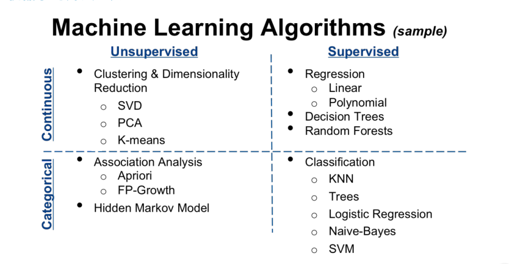
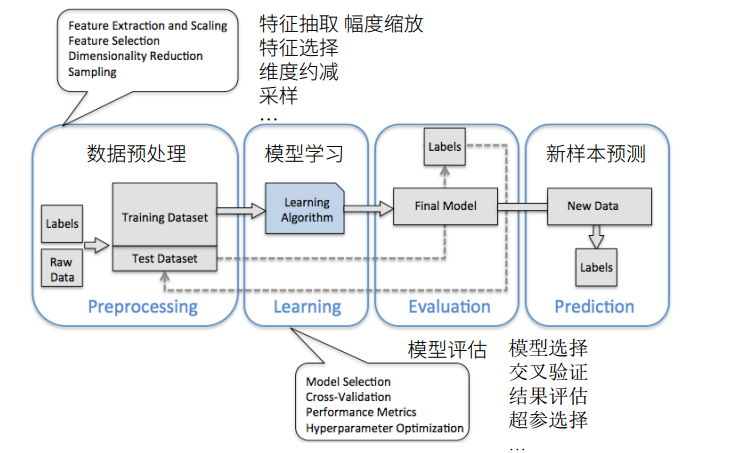
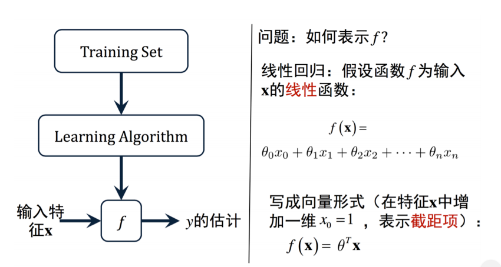
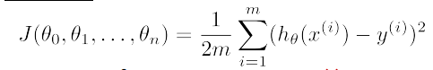
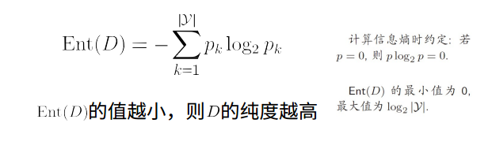
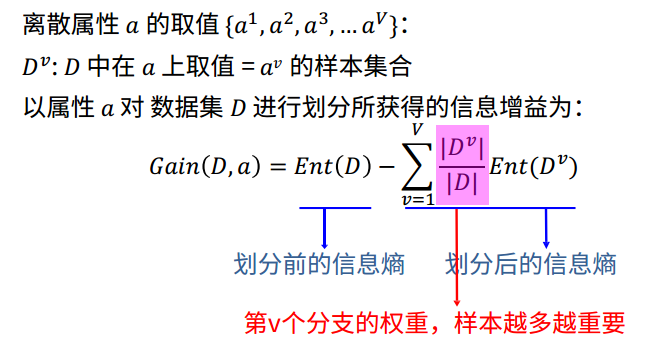
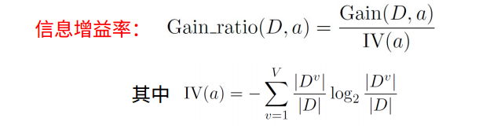
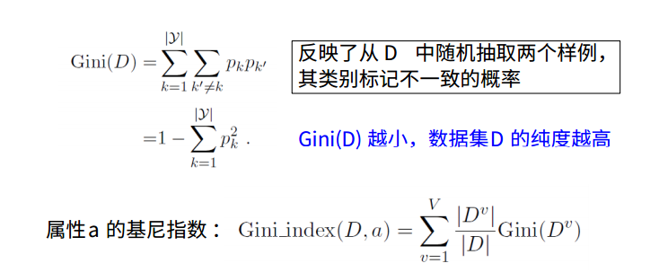
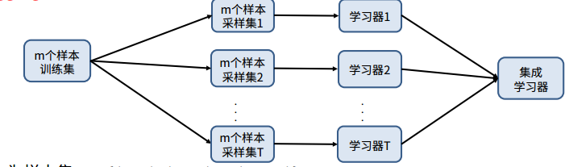
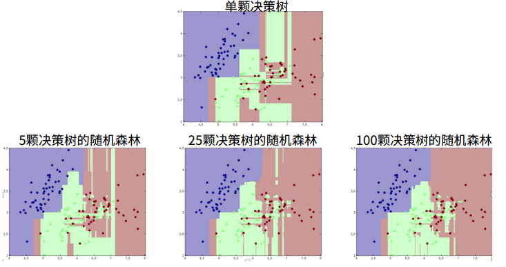

Title         :  Lesson 1
Author        :  张宝峰

[TITLE]

# 机器学习概述
## 概述
  * 机器学习总的来说就是计算机从数据中学习出规律和模式，以应用在新的数据上做预测的任务。
  * 总的来说，机器学习可以分为：监督学习和无监督学习与强化学习。
  * 监督学习：特征+标签
  * 无监督学习：特征
  * 如下图
   * 
    

## 基本流程与工作环节
  * 数据预处理
    * 数据采样、切分，特征抽取、选择与降维
  * 模型学习
    * 超参选择、交叉验证、结果评估、模型选择、模型训练
  * 模型评估
    * 分类、回归、排列苹果标准
  * 模型上线
  * 如下图 
   * 

    
## 评估指标
  * 机器学习的目标
   * 泛化能力强的模型
  * 评估方法
   * 留出法
   * k折交叉验证
   * 自助法
   * .....
  * 性能度量
   * 衡量模型泛化能力的数值评估标准

    
# 线性回归 逻辑回归
## 线性模型
  * 简单，基本，易于解释
  * 通过属性的线性组合来进行预测的函数：
    ** f(x) = w1x1 + w2x2 +..+wdxd + b
  * 向量形式
   ** f(x) = w`Tx + b
## 线性回归的流程图
  * 
## 损失函数
  *  
  * 梯度下降
   ** 逐步迭代减小损失函数
   ** 一元、二元损失函数
   ** 下降学习率太小会使得速度过慢，太大又可能会略过最低点
## 欠拟合与过拟合
 * 欠拟合：模型没有很好不住道数据特征，不能很好地拟合数据
 * 过拟合：将样本中某些特性学习到样本中，与训练集过贴近，是的模型丧失泛化能力
## 广义线性回归

    
# 决策树与分类
## 概述
   * 模拟人类思考过程 相当于程序中的if else
   * 基于树结构进行决策
   * 学习过程通过对训练集的分析来确定内部节点对应的属性
   * 从跟阶段沿着划分属性所构成的顺序吓醒，直到叶节点
## 算法流程与最优属性选择方法
   * 分而治之（divide-and-conquer）
     ** 从根至也叶的递归
     ** 在每个中间节点寻找一个”划分“属性
   * 三种停止条件
     ** 当前节点包含的样本全属于同一类别，无需划分
     ** 当前属性及唯恐或是所有样本在所有属性上取值相同，无法进行划分
     ** 当前节点包含的样本集合为空，不能划分
   * 信息熵
     ** 度量样本纯度的常用指标
     ** 
   * 最佳属性选择方法
    ** 信息增益
    ** 
    **信息增益率
    ** 
    ** 基尼指数
    ** 
## 剪枝与控制过拟合
   * 基本策略
    ** 预剪枝：提前终止某些分支的生长
    ** 后剪枝：生成一颗完全树后再去剪枝
   * 预剪枝 VS 后剪枝
    ** 训练、测试时间开销低，过拟合风险降低 但欠拟合相较于后剪枝风险增加，但是泛化能力低于后剪枝
    

    
# 分类回归与随机森林
## 连续值处理和缺省值处理
   * 连续属性离散化
    ** 二分法
   * 样本赋权，权重划分
## 回归树模型
   * 整个特征空间切分成不相交的子区域
   * 每个区域预估成该区域样本的均值
   *构建
    ** 自顶而下的贪婪是二分希望最小化RSS
    ** 通过正则花去控制过拟合
## 随机森林
   *Bagging 思想
    >pull up bu your own bootstraps 
    ** 
   * 随机森林
    **

